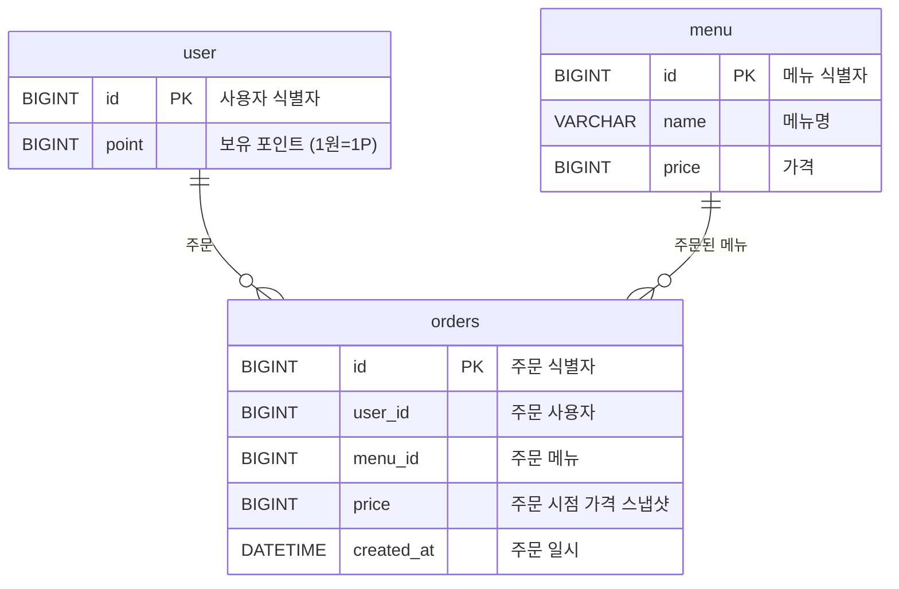

# K사 서버 개발 과제 — 커피숍 주문 시스템

다수 서버 인스턴스 환경에서도 안정적으로 동작하는 커피숍 주문 시스템입니다.

이번 과제에서 가장 신경 쓴 부분은 **포인트 잔액 정합성**과 **인기 메뉴 집계 성능**입니다. 결제가 포인트로만 이루어지기 때문에 동시 주문 시 잔액이 음수가 되거나 한 결제가 두 번 차감되는 상황을 막아야 했고, 인기 메뉴 조회는 매 요청마다 전체 주문 테이블을 GROUP BY 할 수 없으니 별도 집계 구조가 필요했습니다.

각각의 문제에 대해 **조건부 UPDATE**(DB 행 락만 짧게 점유하는 원자적 차감)와 **Kafka + Redis ZSET**(이벤트 기반 비동기 랭킹 집계)으로 풀었습니다. 자세한 선택 근거는 [핵심 설계](#5-핵심-설계) 섹션에 정리했습니다.

---

## 1. 기술 스택

| 구분 | 사용 기술 |
| --- | --- |
| Language | Java 21 |
| Framework | Spring Boot 3.5.14 |
| Persistence | Spring Data JPA |
| Database | MySQL 8 |
| Cache / Ranking | Redis 7 |
| Message Broker | Apache Kafka (KRaft mode) |
| Build | Gradle |
| Infra | Docker Compose |

---

## 2. 실행 방법

### 2-1. 환경 변수 설정

프로젝트 루트에 `.env` 파일 생성:

```env
DB_NAME=coffee
DB_USER=coffee
DB_PASSWORD=coffee
DB_ROOT_PASSWORD=root
```

### 2-2. 인프라 기동

```bash
docker compose up -d
```

| 서비스 | 호스트 포트 | 용도 |
| --- | --- | --- |
| MySQL | 3307 | 메인 데이터 저장소 |
| Redis | 6379 | 인기 메뉴 랭킹 (ZSET) |
| Kafka | 9092 | 주문 이벤트 브로커 |
| Kafka UI | 8081 | Kafka 토픽/메시지 모니터링 |

### 2-3. 애플리케이션 실행

```bash
./gradlew bootRun
```

서버는 `http://localhost:8080` 에서 동작합니다.

---

## 3. ERD



### 테이블 설계 의도

| 테이블 | 역할 | 비고 |
| --- | --- | --- |
| `user` | 사용자 및 포인트 잔액 | 별도 지갑/이력 테이블 두지 않음 (과제 스코프 단순화) |
| `menu` | 메뉴 카탈로그 | 가격 변경 이력은 과제 밖 |
| `orders` | 주문 기록 | **주문 시점 가격을 스냅샷으로 저장** |

### 주요 결정

**FK를 두지 않은 이유**

주문 데이터는 Kafka 이벤트로 발행되어 외부 시스템(인기 메뉴 집계, 데이터 수집 플랫폼 등)에서 독립적으로 소비됩니다. FK 제약을 두면 메뉴 삭제 시 과거 주문이 cascade 영향을 받거나 정책을 신경써야 하지만, `menu_id`를 값으로만 보관하면 주문 이벤트 자체가 자기 완결적인 메시지가 됩니다.

**주문 시점 가격 스냅샷**

`menu.price`를 join해서 조회하면 가격 변경 시 과거 주문 금액까지 함께 변경됩니다. 주문 내역과 인기 메뉴 집계의 시점 일관성을 위해 주문 row에 가격을 박았습니다.

**인기 메뉴 집계 테이블 없음**

`orders` 외에 인기 메뉴용 별도 테이블을 두지 않았습니다. 집계는 Redis ZSET이 담당하며, DB는 원본(source of truth) 역할만 합니다. ([5-3 참고](#5-3-인기-메뉴--kafka--redis-zset))

---

## 4. API 명세

| Method | Path | 설명 |
| --- | --- | --- |
| GET | `/menus` | 커피 메뉴 목록 조회 |
| GET | `/menus/popular` | 최근 7일 인기 메뉴 TOP 3 |
| POST | `/users/{userId}/point/charge` | 포인트 충전 |
| POST | `/orders` | 커피 주문/결제 |

모든 응답은 공통 포맷 `{ status, message, data }` 로 내려갑니다.

---

### 4-1. 메뉴 목록 조회

```http
GET /menus
```

**Response 200**

```json
{
  "status": 200,
  "message": "success",
  "data": [
    { "id": 1, "name": "Americano", "price": 4000 },
    { "id": 2, "name": "Latte", "price": 4500 },
    { "id": 3, "name": "Vanilla Latte", "price": 5000 }
  ]
}
```

---

### 4-2. 인기 메뉴 조회

최근 7일간 주문 횟수 기준 상위 3개 메뉴를 반환합니다. 7일 내 주문이 없으면 빈 배열을 반환합니다.

```http
GET /menus/popular
```

**Response 200**

```json
{
  "status": 200,
  "message": "success",
  "data": [
    { "id": 1, "name": "Americano", "price": 4000, "orderCount": 142 },
    { "id": 3, "name": "Vanilla Latte", "price": 5000, "orderCount": 98 },
    { "id": 2, "name": "Latte", "price": 4500, "orderCount": 75 }
  ]
}
```

---

### 4-3. 포인트 충전

```http
POST /users/{userId}/point/charge
Content-Type: application/json

{
  "amount": 10000
}
```

**Path Variable**

| 이름 | 타입 | 설명 |
| --- | --- | --- |
| `userId` | Long | 사용자 식별자 |

**Request Body**

| 필드 | 타입 | 검증 | 설명 |
| --- | --- | --- | --- |
| `amount` | Long | `@NotNull`, `@Positive` | 충전 금액 (1원=1P) |

**Response 200**

```json
{
  "status": 200,
  "message": "success",
  "data": {
    "userId": 1,
    "point": 10000
  }
}
```

---

### 4-4. 커피 주문/결제

포인트를 차감하고 주문을 생성합니다. 주문 트랜잭션 커밋 후 Kafka로 이벤트가 발행되어 인기 메뉴 랭킹에 반영됩니다.

```http
POST /orders
Content-Type: application/json

{
  "userId": 1,
  "menuId": 2
}
```

**Request Body**

| 필드 | 타입 | 검증 | 설명 |
| --- | --- | --- | --- |
| `userId` | Long | `@NotNull` | 주문 사용자 식별자 |
| `menuId` | Long | `@NotNull` | 주문 메뉴 식별자 |

**Response 201**

```json
{
  "status": 201,
  "message": "주문 성공",
  "data": {
    "orderId": 10,
    "userId": 1,
    "menuId": 2,
    "price": 4500,
    "createdAt": "2026-05-11T13:00:00"
  }
}
```

---

### 4-5. 에러 응답

모든 에러는 공통 포맷으로 내려갑니다.

```json
{
  "status": 400,
  "message": "포인트가 부족합니다.",
  "data": null
}
```

| HTTP | message | 발생 상황 |
| --- | --- | --- |
| 400 | (필드별 validation 메시지) | `@NotNull`, `@Positive` 등 요청 검증 실패 |
| 400 | 포인트가 부족합니다. | 잔액보다 큰 결제 시도 (조건부 UPDATE가 0 row 반환) |
| 404 | 유저를 찾을 수 없습니다. | 존재하지 않는 `userId` |
| 404 | 메뉴를 찾을 수 없습니다. | 존재하지 않는 `menuId` |
| 500 | 서버 오류가 발생했습니다. | 처리되지 않은 예외 |

> 충전 금액이 0 이하인 경우 `@Positive` validation이 먼저 잡아 "충전 금액은 0보다 커야 합니다." 메시지가 내려갑니다. 도메인 레벨(`User.charge()`)에도 동일한 검증을 두어 컨트롤러를 거치지 않는 호출 경로에 대한 이중 방어선을 구성했습니다.

---

## 5. 핵심 설계

이 과제의 핵심 평가 포인트인 **동시성**, **데이터 일관성**, **다중 인스턴스 환경 대응**에 대한 선택과 근거입니다.

### 5-1. 동시성 — 조건부 UPDATE

포인트 차감 시 가장 흔한 문제는 다음과 같은 race condition입니다.

```
T1: SELECT point  → 1000
T2: SELECT point  → 1000
T1: UPDATE point = 0   (한 번 차감)
T2: UPDATE point = 0   (또 한 번 차감 — 실제로는 한 건만 결제됐어야 함)
```

이 문제를 해결하는 방식은 여러 가지가 있습니다.

| 방식 | 장점 | 단점 | 채택 |
| --- | --- | --- | --- |
| 비관적 락 (`SELECT FOR UPDATE`) | 구현 단순 | SELECT~commit 동안 행 락 유지, 커넥션 점유 길어짐 | ❌ |
| 낙관적 락 (`@Version`) | 락 대기 없음 | 충돌 시 재시도 로직 별도 구현 필요 | ❌ |
| 분산 락 (Redisson) | 다중 인스턴스 대응 | 단일 row 산술 연산에는 과한 도구 | ❌ |
| **조건부 UPDATE** | **DB 행 락을 UPDATE 한 문장 동안만 점유, 별도 인프라 불필요** | 단순 차감 외 복잡 비즈니스에는 부적합 | ✅ |

본 과제의 포인트 차감은 **단일 row의 단순 산술 연산**입니다. InnoDB는 UPDATE 시 자동으로 해당 행에 X-lock을 걸지만, 그 점유 시간은 UPDATE 한 문장이 실행되는 동안으로 매우 짧습니다. 애플리케이션 레벨에서 명시적인 락을 추가하지 않고도 정합성을 보장할 수 있습니다.

```sql
UPDATE user SET point = point - :amount
WHERE id = :userId AND point >= :amount
```

WHERE 절에 `point >= :amount` 조건을 함께 두어 잔액 부족 시 0 row가 영향받도록 했고, 반환값이 0이면 `INSUFFICIENT_POINT` 예외를 던집니다. 락 대기 시간이 짧아 처리량 측면에서도 유리합니다.

### 5-2. 데이터 일관성 — AFTER_COMMIT 이벤트 발행

주문 처리는 다음 순서로 이루어집니다.

1. 유저/메뉴 조회
2. 포인트 차감 (조건부 UPDATE)
3. 주문 저장
4. Kafka로 주문 이벤트 발행 → 인기 메뉴 랭킹 갱신

이 중 **4번을 트랜잭션 안에서 수행하면 위험합니다.** 주문 트랜잭션이 어떤 이유로든 롤백되어도 Kafka 메시지는 이미 발행된 상태가 되어, "DB에는 없는 주문이 인기 메뉴에 카운트되는" 정합성 오류가 발생할 수 있습니다.

이를 막기 위해 **Spring `ApplicationEvent` + `@TransactionalEventListener(AFTER_COMMIT)`** 조합으로 발행 시점을 분리했습니다.

```
[OrderService] 주문 트랜잭션 시작
  ├─ user, menu 조회
  ├─ 포인트 차감 (조건부 UPDATE)
  ├─ orders INSERT
  └─ ApplicationEventPublisher.publishEvent(OrderCreatedEvent)   ← 큐에 등록만
[트랜잭션 커밋 성공]
  └─ @TransactionalEventListener(AFTER_COMMIT) 발동
     └─ [OrderKafkaEventHandler] kafkaTemplate.send(...)          ← 이때 실제 Kafka 발행
```

트랜잭션이 롤백되면 AFTER_COMMIT 단계 자체가 실행되지 않으므로 Kafka 발행도 일어나지 않습니다.

> **한계**:
> - AFTER_COMMIT 직후 서버가 죽으면 Kafka 발행이 누락될 수 있습니다.
> - 현재 `kafkaTemplate.send()`의 반환값을 핸들링하지 않아 발행 실패 시 재시도/로깅이 없습니다.
>
> 완전한 정확성이 필요하다면 Outbox 패턴이나 CDC 도입이 필요하지만, 본 과제 스코프에서는 과설계라 판단해 적용하지 않았습니다.

### 5-3. 인기 메뉴 — Kafka + Redis ZSET

매 요청마다 `orders` 테이블을 GROUP BY 하는 방식은 주문 수가 늘어날수록 비용이 선형 증가합니다. 이를 피하기 위해 **주문 발생 시점에 Redis ZSET에 미리 기록**하고, 조회 시에는 score 범위 조회로 빠르게 응답하도록 설계했습니다.

```
[OrderService] 주문 저장 + ApplicationEvent 발행
      ↓ (AFTER_COMMIT)
[OrderKafkaEventHandler] Kafka 토픽으로 발행
      ↓
[OrderEventConsumer] @KafkaListener로 수신
      ↓
[OrderRankingService] Redis ZSET에 (orderId:menuId, epochMilli) 기록
```

#### ZSET member 설계

| 항목 | 값 |
| --- | --- |
| key | `order:ranking` |
| member | `{orderId}:{menuId}` |
| score | 주문 시각 (epoch milli) |

`menuId`만 member로 쓰면 ZSET 특성상 같은 member는 score만 덮어써져 **카운트가 누락**됩니다. orderId를 포함시켜 모든 주문이 별개 member로 기록되도록 했습니다.

#### 조회 흐름

1. `ZRANGEBYSCORE` 로 최근 N일 이내 member 추출
2. member 파싱하여 menuId별 카운트 집계
3. 상위 limit개의 menuId를 `findAllById`로 한 번에 조회 (N+1 방지)
4. 랭킹 순서를 유지하며 응답 구성

#### 왜 Kafka를 사이에 두는가

`OrderService`에서 Redis를 직접 호출하는 방법도 가능합니다. 그러나 Kafka를 도입한 이유는 다음과 같습니다.

- **요구사항 충족**: "주문 내역을 데이터 수집 플랫폼으로 실시간 전송"이라는 과제 요구사항을 Kafka Topic 분리로 자연스럽게 만족
- **확장성**: 향후 다른 Consumer Group(예: 데이터 수집 플랫폼, 알림 서비스)이 같은 이벤트를 독립적으로 소비 가능
- **도메인 경계**: 현재는 단일 애플리케이션이라 결합 분리 효과가 제한적이지만, 향후 랭킹/수집 등이 별도 서비스로 분리될 때를 대비해 도메인 경계를 미리 그어둠

### 5-4. 다중 인스턴스 환경 대응

| 영역 | 대응 방식 |
| --- | --- |
| 포인트 정합성 | DB의 행 단위 X-lock — 인스턴스 수와 무관하게 정합성 보장 |
| 인기 메뉴 랭킹 | Redis 단일 외부 저장소 공유 |
| 이벤트 처리 | Kafka Consumer Group으로 메시지 분산 처리 (`coffee-app` 그룹) |
| 메시지 키 | `orderId`를 Kafka 메시지 키로 사용하여 동일 주문 이벤트는 동일 파티션 보장 |
| 세션 | 무상태(stateless), 인스턴스 간 공유 데이터 없음 |

---

## 6. 디렉토리 구조

```
src/main/java/com/coffee
├── CoffeeApplication.java
├── common
│   ├── exception        # CustomException, ErrorCode, GlobalExceptionHandler
│   └── response         # ApiResponse 공통 응답 포맷
├── config
│   └── RedisConfig      # StringRedisTemplate 빈 등록
└── domain
    ├── menu             # 메뉴 도메인 (조회, 인기 메뉴)
    │   ├── controller
    │   ├── dto
    │   ├── entity
    │   ├── repository
    │   └── service
    ├── order            # 주문 도메인 (결제, 이벤트, 랭킹)
    │   ├── controller
    │   ├── dto
    │   ├── entity
    │   ├── event        # OrderCreatedEvent, Publisher, KafkaHandler, Consumer
    │   ├── repository
    │   └── service      # OrderService, OrderRankingService
    └── user             # 유저 도메인 (포인트 충전)
        ├── controller
        ├── dto
        ├── entity
        ├── repository
        └── service
```